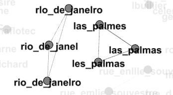
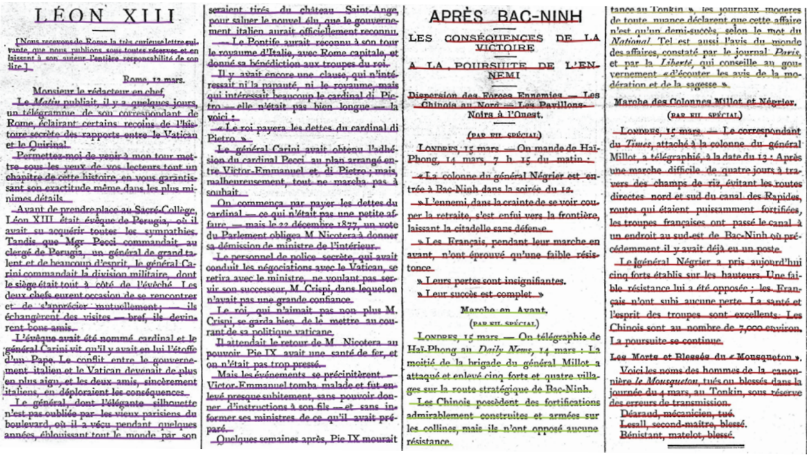
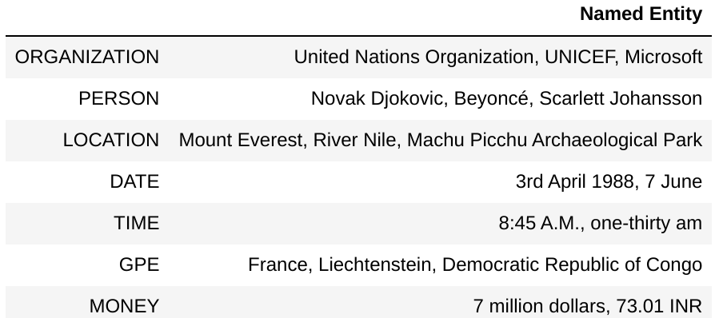

# 1.2.2. From Data to Information: Overview

It is now clear that in order to scientifically exploit digitized historical newspaper data, we must understand the processes that transform and make the data accessible. We will list and define each of these processing steps, which will then be studied in detail in the next units of the course.

## OCR

Optical Character Recognition (OCR), also called Automated Text Recognition (ATR) is the task of automatically transcribing the textual contents contained in images. This is a fundamental step in all digitalization process, as it provides the textual data which is needed to further be processed in Natural Language Processing tasks.

OCRed documents contain numerous errors due to the state of documents, as a result of aging, poor storage conditions and/or the low quality of initial printing materials. These errors reduce the performance of all downstream natural language processing tasks.

Here are some examples of character recognition errors :

## Article separation

Moreover, in the specific case of digitized historical newspapers, a step related to OCR is necessary to fully exploit the potential of the data.

Article Separation (AS) is defined as the task of identifying regions on a newspaper page that hold information to one article and is an important step for further natural language processing applications in the information retrieval pipeline. However, the AS task can be
divided into two parts: (text) block recognition and subsequent clustering.

The proper working of this step determines our ability to query not only whole pages of newspapers but also articles. This makes it much easier to build a corpus on which to base further analysis.

## Semantic Text Enrichment

Semantic text enrichment consists of analyzing documents and adding semantic metadata to their
contents. In the case of historical newspapers, among several semantic metadata, we concentrate on named entities. Named entities are generally proper nouns that refer to specific entities that can be a person, organization, location, date, etc. If we consider this sentence as an example: Mount Everest is the tallest mountain above sea level, NER should detect Mount Everest as a named entity of type location as it refers to a specific entity.

Some other examples of named entities are listed in the following table:

When we talk about Semantic Text Enrichment more precisely, we aim to recognize these entities in documents and disambiguate them to a knowledge base. In addition, these entities will be associated with the stance of the text in which they are mentioned.

Named Entity Recognition is one of the most important and most studied tasks in NLP. It has many industrial and scientific applications. It can clearly facilitate information retrieval in historical newspapers.
